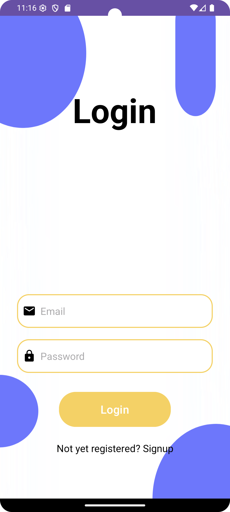
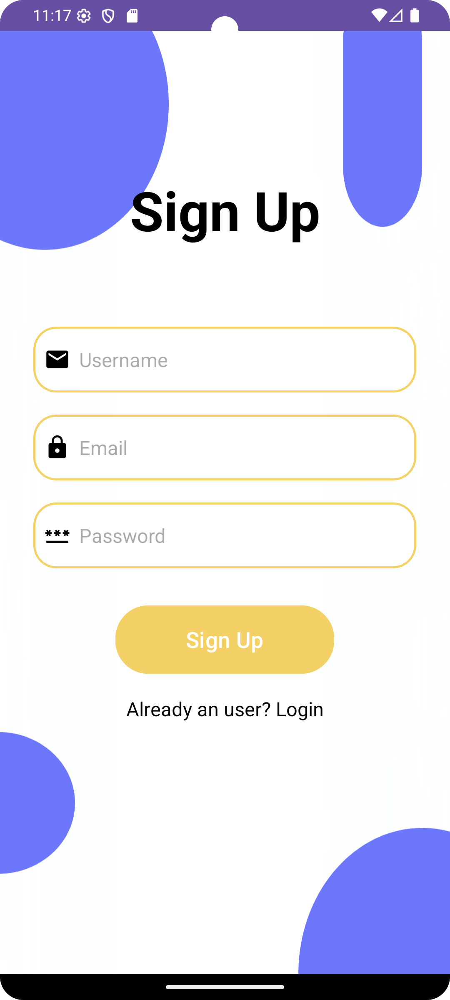
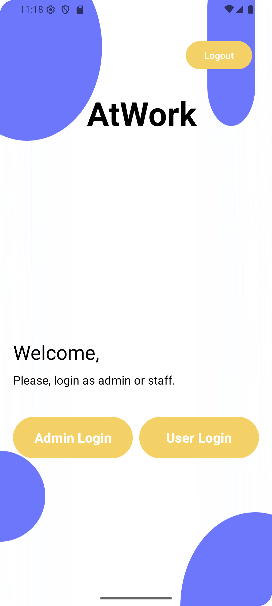
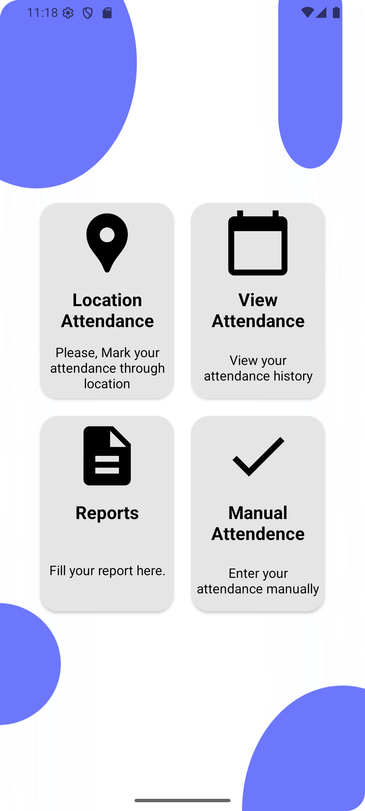
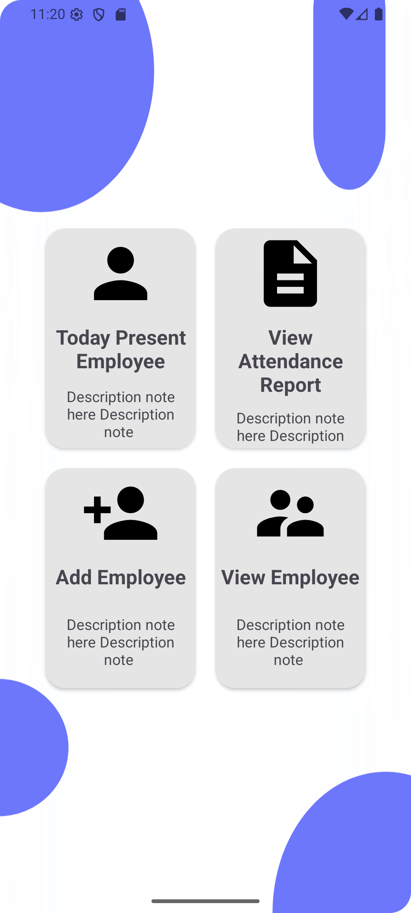
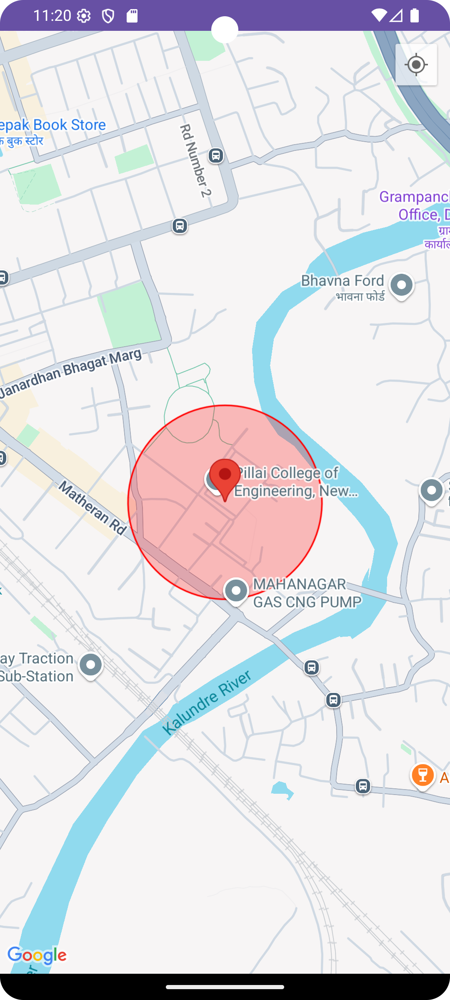
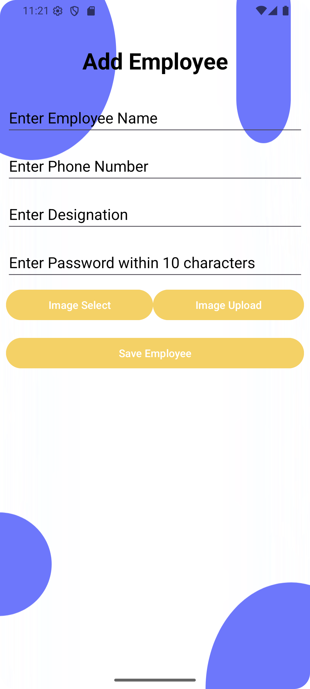

# 📍 AtWork - Geolocation-Based Attendance Tracking App

---

## 📱 Overview

**AtWork** is a mobile application designed for universities and organizations to streamline attendance marking using geolocation and biometric authentication.

Key Features:
- GPS-based geofencing for automatic attendance
- Fingerprint authentication for secure login
- Role-based access for Admin and Staff
- Reward system via bonus points for regular attendance
- Digital attendance history, reports, and manual fallback
- Eco-friendly, paperless, and remote-ready

---

## 🧠 Features

### 🔐 Authentication
- Login & Signup screens for new and existing users
- Role-based redirection for **Admin** and **Staff**
- Biometric fingerprint login for added security

### 📍 Geolocation Attendance
- Uses device GPS to detect presence in geofenced campus area
- Map integrated for location visualization
- Attendance is marked automatically when inside the red zone

### 📊 Attendance & Reports
- Real-time attendance dashboard
- Manual attendance submission option
- Submit daily work reports

### 🧑‍💼 Admin Functionalities
- View present employees
- Add new employees with photo, contact & role
- View and download attendance reports

### 🎁 Bonus Points System *(Prototype)*
- Employees earn points for timely attendance
- Redeem points for special leave requests (future scope)

---

## 🛠️ Technical Stack

- **Frontend**: Java
- **Location Services**: Google Maps API, Geofencing
- **Authentication**: Firebase / Biometric APIs
- **Backend**: Firebase
- **Database**: Firebase Firestore

---

## 📸 Screenshots

| Login | Signup | Role Selection |
|-------|--------|----------------|
|  |  |  |

| Staff Home | Admin Home | Geo Fence |
|------------|------------|-----------|
|  |  |  |

| Add Employee |
|--------------|
|  |

---

## 🧪 Feasibility & Challenges

### ✅ Feasibility
- Uses reliable GPS/Wi-Fi geolocation
- Cost-effective with open-source tools and APIs

### ⚠️ Challenges
- Location inaccuracy & GPS permission handling
- Fingerprint sensor integration
- Privacy concerns with location data
- Secure biometric and user data storage

---

## 🌱 Environmental Impact

- Reduces paper usage with digital attendance
- Encourages remote attendance, reducing commuting emissions
- Bonus system promotes engagement in eco-friendly initiatives

---

## 📌 Future Improvements

- Full-featured bonus points leave system
- Face recognition login
- Push notification reminders
- Admin analytics dashboard (charts & graphs)

---

